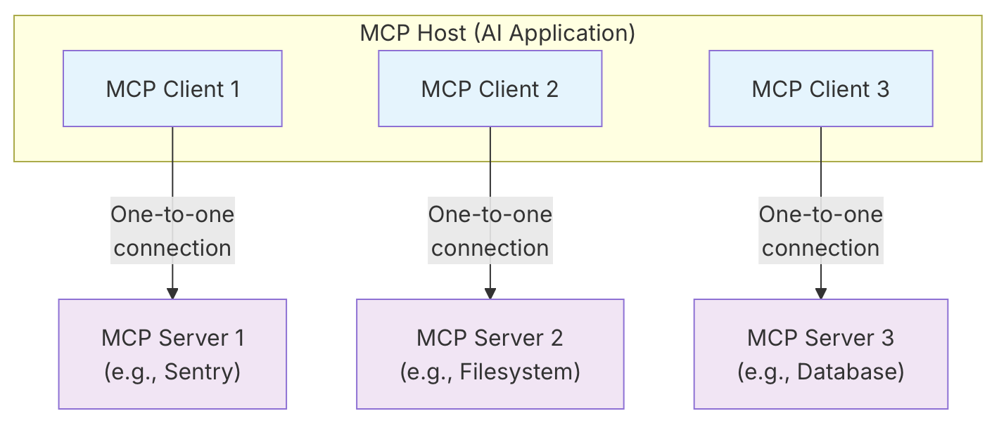

# MCP (Model Context Protocol)

본 README는 테디노트님의 **[🔥 Cursor AI 말고, 나만의 #MCP 에이전트 앱 만들어 보기! 🔥](https://www.youtube.com/watch?v=ISrYHGg2C2c)** 강의를 참조하여 작성되었습니다

- MCP는 Model Context Protocol의 약자로,
  - Model: LLM 모델에게
  - Context: 컨텍스트를 제공하는
  - Protocol: 통신규약 (프로토콜)
    입니다.

## MCP 구성

- MCP는 크게 세 컴포넌트로 구성되어 있습니다
  

### MCP Host

- MCP 호스트는 사용자가 MCP를 활용하는 LLM과 직접 상호작용할 수 있는 플랫폼이나 시스템을 의미합니다.
- 흔히 사용하는 Claude Desktop이나 Cursor IDE가 MCP 호스트라고 보면 되겠습니다.

### MCP Client

- 호스트 내부에서 MCP Server와의 연결을 담당하는 중계자 역할을 하는 구성 요소입니다. MCP Server와 1:1 방식으로 연결을 유지합니다
- MCP Server에 요청(request)을 전달하고, 응답(response)을 받아 처리합니다.
- 요청을 구조화된 형식으로 변환하고, 캐시 혹은 대체(fallback) 메커니즘을 관리하기도 합니다

### MCP Server

- MCP서버는 MCP 클라이언트에서 오는 요청에 따라 특화된 데이터나 도구, 기능을 제공하는 외부 시스템 혹은 프로세스입니다
- 데이터베이스, 파일 시스템, 외부 API(예: Google Sheets, Slack API 등) 등과 통신하여 실질적인 작업을 수행합니다
- 로컬 또는 원격 환경에서 실행될 수 있으며, 표준화된 MCP 인터페이스를 통해 호스트와 상호작용합니다

MCP의 가장 큰 장점은 LLM 모델에 구애받지 않고, 필요한 도구나 데이터를 연동시킬 수 있다는 점입니다.

## MCP Host 직접 구현

- Claude Desktop이나 Cursor AI와 같은 이미 만들어진 MCP 호스트를 사용하면 MCP서버를 손쉽게 연동하여 사용할 수 있습니다. 하지만, 새로운 서비스를 만들거나 개인화된 LLM Agent를 만드려면, MCP 호스트와 MCP 클라이언트를 직접 구현해야 합니다.
- LLM Agent를 개발할 때 많이 사용되는 파이썬 라이브러리인 LangChain과 LangChain에 맞게 개발된 MCP 클라이언트인 Langchain-MCP-Adapters를 사용하여, MCP 호스트를 직접 구해보겠습니다.

1.  먼저, 비행기 표를 예매해주는 MCP 서버를 만듭니다.

```python
from mcp.server.fastmcp import FastMCP

mcp = FastMCP(
    "FlightBooking",
    instructions="You are a helpful assistant that can help with flight booking.",
    host="0.0.0.0",
    port=8001
)

@mcp.tool
def get_flight_info(country: str) -> dict:
    """
    Get flight information for a given country.

    This function returns a list of flight information for the given country.

    Args:
        country (str): The country to get flight information for.

    Returns:
        dict: The flight information for the given country.
    """
    flight_info = {
        {"airport": "ICN",
        "flight_number": "ABC123",
        "flight_to": "LAX"},
        {"airport": "ICN",
        "flight_number": "DEF456",
        "flight_to": "NRT"},
        {"airport": "ICN",
        "flight_number": "GHI789",
        "flight_to": "HNL"},
    }
    return flight_info


if __name__ == "__main__":
    mcp.run()
```

#### 참조링크

- [Anthropic MCP 공식 문서](https://modelcontextprotocol.io/docs/learn/architecture)
- [How to MCP: The Complete Guide to Understanding Model Context Protocol and Building Remote Servers](https://simplescraper.io/blog/how-to-mcp#why-mcp-is-frustrating-today)
- [테디노트: 🔥 Cursor AI 말고, 나만의 #MCP 에이전트 앱 만들어 보기! 🔥](https://www.youtube.com/watch?v=ISrYHGg2C2c)
- [MCP Tutorial: Build Your First MCP Server and Client from Scratch (Free Labs)](https://www.youtube.com/watch?v=RhTiAOGwbYE)
- [What is an MCP Server, MCP Client, and MCP Host?](https://mcpcat.io/blog/mcp-server-client-host/)
